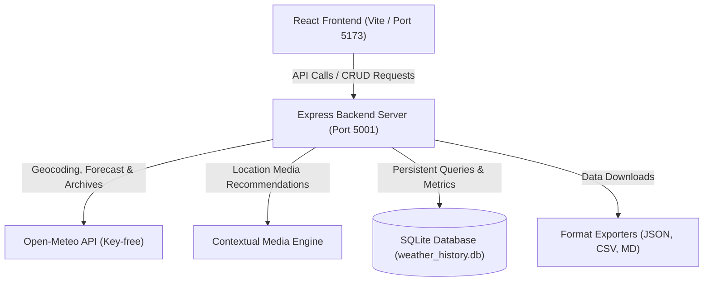

# AeroWeather - Full-Stack Weather Portal & Forecasting Model
**Applicant:** Teeyansh Shukla  
**Target Role:** AI Engineer Intern (Product Manager Accelerator Technical Assessment)

---

## 🌟 Project Overview
AeroWeather is a modern full-stack web application designed for comprehensive weather tracking and climate forecasting. The system integrates real-time forecast data, maps, contextual visual guides, data persistence (CRUD logs), and a dedicated data science predictive framework.

This repository satisfies the criteria for both **Frontend Engineers (Assessment 1)** and **Backend/Full-Stack Engineers (Assessment 2)**, alongside the **Data Science & Trend Forecasting Assessment**.

---

## 🏗️ System Architecture

The following diagram illustrates the flow of data across the AeroWeather full-stack system:



---

## 🚀 Key Features

* **Interactive Dashboard:** Modern responsive weather dashboard using a glassmorphism-inspired interface with dynamic backgrounds shifting according to the current weather condition.
* **Geolocation Integration:** Automatic current location tracking via browser Geolocation API.
* **Location Search:** Handles zip codes, GPS coordinates, landmarks, and city names with fuzzy matching.
* **Database persistence (CRUD):** 
  - **CREATE:** Log location queries alongside custom start/end dates. The server validates input ranges, resolves coordinates, fetches historical weather, and logs the records.
  - **READ:** Table showing all previously logged ranges.
  - **UPDATE:** Update existing log targets/dates, re-triggering geocoding validations and weather fetches.
  - **DELETE:** Clear records from the SQLite db.
* **Multiple Export Formats:** Download history in JSON, CSV, or Markdown.
* **Google Maps Embedding:** Visual map representation of the searched location.
* **Location-based Media Recommendations:** Provides contextual media recommendations and embedded location visualization for searched destinations.
* **Data Science Forecasts:** A comprehensive machine learning workflow predicting temperatures based on atmospheric variables, complete with anomaly detection, spatial coordinate mappings, and model ensembling.

---

## 🛠️ Technology Stack

* **Frontend:** React, Vite, React Icons, Vanilla CSS (Custom Design System with Variables, Blurs, Gradients, and Transitions).
* **Backend:** Node.js, Express, SQLite3 (persistent local database).
* **Data Science:** Python 3, pandas, numpy, scikit-learn, xgboost, matplotlib, seaborn (Jupyter Notebook).

---

## 📦 Installation & Setup

### 1. Requirements & Dependencies
Ensure you have **Node.js** and **Python 3** installed.

### 2. Express Backend Setup
Navigate to the backend directory, install packages, and boot the server:
```bash
cd 2_Backend
npm install
npm start
```
The server will run on **`http://localhost:5001`**. A local file `weather_history.db` will be created automatically.

### 3. React Frontend Setup
Navigate to the frontend directory, install packages, and start the development server:
```bash
cd 1_frontend
npm install
npm run dev
```
Open **`http://localhost:5173`** in your browser to interact with the application.

### 4. Data Science Execution
Set up a virtual environment and install the required data science packages:
```bash
# From the project root
python3 -m venv venv
source venv/bin/activate
pip install -r 3_Data-science/requirements.txt

# Run the programmatic notebook executor
python3 3_Data-science/run_and_enhance_notebook.py
```
This script runs the cells programmatically, handles intermediate states, trains the models, and writes the charts to the report visualizations folder.

---

## 🔌 API Endpoints (Backend)

* **`GET /api/weather/search?q=...`**: Fuzzy lookup returning coordinate data (latitude, longitude, resolved name).
* **`GET /api/weather/forecast?lat=...&lon=...&name=...`**: Returns current conditions, 5-day forecast, embedded maps URL, and local media recommendations.
* **`POST /api/history`**: Logs a weather search target and date range. Triggers geocoding, historical weather retrieval, and SQLite write.
* **`GET /api/history`**: Lists all persistent query records.
* **`PUT /api/history/:id`**: Updates target location, dates, or notes of a record (re-validates and updates weather metrics).
* **`DELETE /api/history/:id`**: Deletes record from the SQLite registry.
* **`GET /api/history/export?format=json|csv|markdown`**: Triggers file download of the logs database.

---

## 📈 Data Science Analysis & Results

Our models were evaluated on the test set from the Kaggle **Global Weather Repository** dataset (145,017 records):

### Model Comparison Metrics (Test Set)

| Model | MAE (Mean Abs Error) | RMSE (Root Mean Sq Error) | R² Score (Variance Explained) |
| :--- | :---: | :---: | :---: |
| **Linear Regression** | 5.73°C | 7.43°C | 0.403 |
| **XGBoost Regressor** | 3.58°C | 5.08°C | 0.721 |
| **Weighted Ensemble** | 3.56°C | 4.97°C | 0.733 |
| **Random Forest Regressor** | **3.09°C** | **4.66°C** | **0.765** |

### Performance Analysis:
The Random Forest model achieved the strongest predictive performance across evaluation metrics, outperforming both Linear Regression and XGBoost. Although the weighted ensemble demonstrated stable predictive behavior and competitive generalization, it did not surpass the standalone Random Forest model on this dataset. This suggests that tree-based bagging methods captured the nonlinear weather relationships more effectively for global temperature forecasting.

Detailed visualizations and outlier analyses can be reviewed in the Technical Report:
* **[4_Report/Weather_Trend_Forecasting_Report.md](4_Report/Weather_Trend_Forecasting_Report.md)**

---

## 🎯 PM Accelerator Mission
> *"To break down financial barriers and achieve educational fairness, empowering professionals to become the next generation of AI product leaders through hands-on, real-world product and technical innovations."*

---

## 🔮 Future Improvements & Scalability Opportunities
1. **[COMPLETED] Incremental DB Caching:** Queries check the SQLite history registry using coordinates and date ranges. If a matching query is found, the server serves the data directly from the local cache to minimize external API hits.
2. **[COMPLETED] Interactive GIS Mapping:** Upgraded the static Google Maps iframe to an interactive Leaflet.js layout that displays localized maps and overlays live precipitation radar via RainViewer.
3. **[COMPLETED] Deep Time-Series forecasting:** Integrated a PyTorch-based Long Short-Term Memory (LSTM) neural network in the data science pipeline to forecast global average daily temperatures.
4. **Production Database Migration:** For production deployment, migrate the local SQLite file to a cloud **PostgreSQL** or **MongoDB** database to support scaling, connection pooling, and multi-user concurrent writes.
